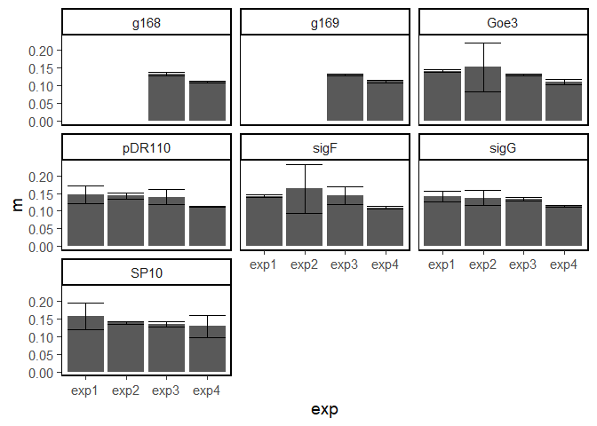

Growth curves for strains with inducible sigma factors
================

``` r
library(renv)
library(here)
library(tidyverse, quietly = TRUE)
library(broom, quietly = TRUE)
library(cowplot, quietly = TRUE)
```

## Read in data

The reads were taken at 2 min intervals. To smooth the data we average
over a sliding window, without overlaps, of 8 reads (\~15min).

``` r
experiments <- list.files(here("data/plate_reader"), 
                          pattern = "OD600", full.names = TRUE)
win.size <-  8

# tibble to collect averaged data
d <-  tibble()

for (e in experiments){
  # which experiment
  exp <- str_extract(e, "exp.")
  
  input <- read_csv(e)
  meta <- read_csv(here("data/plate_reader/", paste0(exp, "_meta.csv")))
  #time in hours
  input$Time <- 24*input$Time
    
  # average OD
    # remove last rows so it divides by 8
    input <- input[1:(win.size*floor(nrow(input)/win.size)),]
    input.avg <- tibble()
    for(i in seq(nrow(input)/win.size)){
      row1 <- ((i-1)*win.size)+1
      input.avg <- 
        apply(input[row1:(row1+win.size-1),], 2,mean) %>% 
        bind_rows(input.avg, .)
    }
  
  
  #transform to long format
    d <- 
      input.avg %>% 
      mutate(exp = exp) %>% 
      pivot_longer(colnames(input)[-c(1:2)], 
                   names_to = "well", values_to ="OD600" ) %>% 
      left_join(., meta, by = "well") %>% 
      bind_rows(d,.)
      
}

# make sample identifier
d <- d %>% 
  mutate(sample.id = paste(exp, well, sep = "_")) %>% 
  # fix different notations across experiments
  mutate(strain = str_replace(strain, "DSM", "Blank")) %>% 
  mutate(treat = str_replace(treat, "Water", "noIPTG"))

rm(input, input.avg, meta, row1, win.size, i, e, exp, experiments)


# # confirm layout
# d %>%
#    ggplot(aes(col,row))+
#    geom_tile(aes(fill = colony))+
#    geom_text(aes(label =rep, color  = strain))+
#    facet_wrap(.~exp)+
#    scale_y_discrete(limits=rev)+
#    scale_x_continuous(breaks = 1:12)+
#    scale_fill_viridis_d()
```

### plotting the data

Plot by strain, all wells

``` r
d%>%
  # filter(Time<5)%>%
  ggplot(aes(x=Time, y=OD600))+
  geom_vline(xintercept = 4.5, color="grey")+
  geom_line(aes(group = sample.id, color=treat), size=1)+
  
  facet_wrap(~strain)+

  theme_classic(base_size = 14)+
  panel_border(color = "black")+
  scale_colour_viridis_d()
```

<!-- --> In all
cases, it seems that the addition of IPTG at 4.5 hrs (gray vertical
line), occurred prior to the transition into stationary phase.

There were a few instances of contamination (water used in no-IPTG
samples), but very low, as evident by late rise of OD in those wells.
Overall, 3 wells of 25 blanks setup. Removing blanks.

``` r
d <- filter(d, strain != "Blank")
```

Plot by strain, average over colonies.

``` r
sum_colonies <- 
  d %>% 
  group_by(Time, strain, treat, exp, colony) %>% 
  summarise( n =n(), m = mean(OD600), v = sd(OD600)/n, .groups = "drop") %>% 
  mutate(col.id = paste(exp, strain, treat,colony), sep ="_") %>% 
  # arrang labels
  mutate(strain=str_replace(strain,"^g","ELDg"))%>%
   mutate(strain = str_replace(strain, "pDR110", "empty vctr")) %>% 
   mutate(strain = fct_relevel(strain,"empty vctr","sigF", "sigG","SP10", "Goe3","ELDg168", "ELDg169"))

p <- sum_colonies%>%
  # filter(Time<5)%>%
  ggplot(aes(x=Time, y=m))+
  geom_vline(xintercept = 4.5, color="grey")+
  geom_line(aes(group = col.id, color=treat), size=.5)+
  # geom_errorbar(aes(ymin = m-v, ymax = m+v,  color=treat), alpha = 0.5)+
  facet_wrap(~fct_rev(strain))+
  
  ylab("OD600")+
  xlab("Time (hr)")+

  theme_classic(base_size = 14)+
  panel_border(color = "black")+
  scale_colour_viridis_d()+
  theme(legend.position = c(.9, .1), 
        legend.box.background = element_rect(colour = "grey"))

ggsave(here("fig/induction_growth_OD.png"),p,
       width = 6, height = 4)
p  
```

<!-- --> Plot by
strain, panel per colony.

``` r
col_numbers <-
  sum_colonies %>% 
  mutate(col.id2 = paste(exp, strain, colony), sep ="_") %>%
  select(strain, col.id2) %>% 
  distinct() %>% 
  group_by(strain) %>% 
  mutate(n.col = row_number()) %>% 
  ungroup() %>% 
  select(col.id2, n.col)
  
p <- sum_colonies %>% 
  mutate(col.id2 = paste(exp, strain, colony), sep ="_") %>%
  left_join(., col_numbers, by = "col.id2") %>% 
  mutate(IPTG = if_else(treat=="IPTG", "+","-") %>% fct_rev()) %>% 
  
  ggplot(aes(x=Time, y=m))+
  geom_vline(xintercept = 4.5, color="grey")+
  geom_line(aes(group = col.id, color=IPTG), size=.5)+
  geom_errorbar(aes(ymin = m-v, ymax = m+v,  color=IPTG), alpha = 0.2)+
  facet_grid(fct_rev(strain) ~ n.col)+
  
  ylab("OD600")+
  xlab("Time (hr)")+
  scale_x_continuous(breaks = c(0,12,24))+
  labs(caption = "mean±SE (n=3)")+

  theme_classic(base_size = 12)+
  panel_border(color = "black")+
  scale_colour_viridis_d()+
  theme(legend.position = c(.93, .4), 
        legend.box.background = element_rect(colour = "grey"),
        legend.text = element_text(size=14, face = "bold"),
        strip.text = element_text(size = 10),
        panel.grid.major = element_blank(),
        panel.grid.minor = element_blank(),
        strip.background = element_blank())
  
# ggsave(here("fig/induction_growth_OD_colonies.png"),p,
#        width = 8, height = 6)
# p  
```

``` r
#https://stackoverflow.com/questions/49521848/remove-unused-facet-combinations-in-2-way-facet-grid
library(grid)
library(gtable)

# Turn your ggplot2 plot into a grob.
grob <- ggplotGrob(p)
# Working out which facets to remove, and which axes to move where depends on the grid-structure of your grob. gtable_show_layout(grob) gives a visual representation of your grid structure, where numbers like (7, 4) denote a panel in row 7 and column 4.
# gtable_show_layout(grob, cell.label = T)
# grob$layout$name

# Remove facets
rmv.panels <- paste0("panel-", rep(3:7,each = 2),"-", 9:10) #%>% paste0(.,9:10)
idx <- which(grob$layout$name %in% rmv.panels)
for (i in idx) grob$grobs[[i]] <- nullGrob()

# Move x axes up
# axis-b-9 and axis-b-10 needs to move up 10 rows (5 rows and 5 gaps)
idx <- which(grob$layout$name %in% c("axis-b-9", "axis-b-10"))
grob$layout[idx, c("t", "b")] <- grob$layout[idx, c("t", "b")] - 10

# Move panel strips left 
idx <- which(grob$layout$name %in% paste0("strip-r-", 3:7))
grob$layout[idx, "r"] <- grob$layout[idx, "r"] - 8

# Plot
ggsave(here("fig/induction_growth_OD_colonies.png"),grob,
       width = 8, height = 6)

grid.draw(grob)
```

<!-- -->

## OD at innoculation

``` r
d %>% 
  filter(strain !="Blank") %>% 
  group_by(exp) %>% 
  slice_min(Time, n = 1) %>% 
  group_by(strain, exp) %>%
  summarise(m = mean(OD600), v = sd(OD600), n =n(), .groups = "drop") %>% 
    ggplot(aes(x=exp, y=m))+
    geom_col()+
    geom_errorbar(aes(ymin = m-v, ymax = m+v))+
    theme_classic(base_size = 14)+
    panel_border(color = "black")+
    facet_wrap(~strain)
```

<!-- -->
