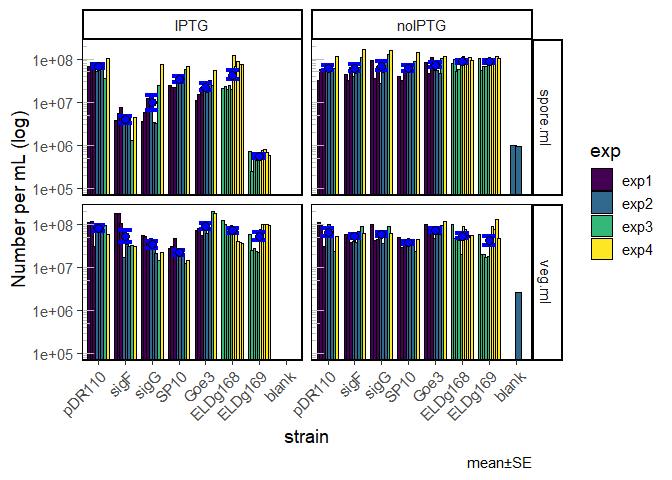
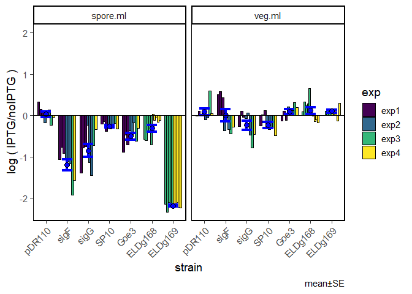
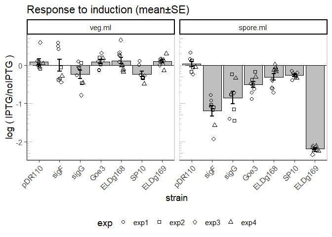
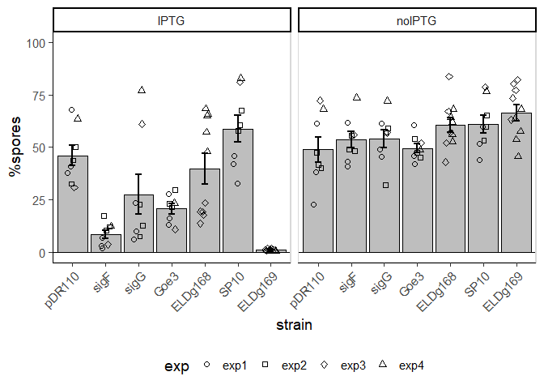

Sporulation assay with IPTG-induced sigma factors
================

**Only consider counts with at least 100 events**

Quantities based on lower event counts are designated a value of 1
cell/mL, to prevent problems with ratio and logs.

# Replication outliers

I have N=3 for each flask at each time point. There are some
measurements which are obviously way off. To get rid of these I will
choose from each triplicate the 2 points that are in best agreement and
remove the 3rd point. There is a function to idenify such a point in
pacakge ‘outliers’ &gt; outlier {outliers} Finds value with largest
difference between it and sample mean, which can be an outlier.

> logical: if set to TRUE, gives vector of logical values, and possible
> outlier position is marked by TRUE

I will apply the outlier filtering on the number of total cells
(veg+spore)

# Overview of results

Concentrations of cell types:
<!-- -->
Remove blanks

Change in respnse to induction, log10(IPTG/noIPTG):

<!-- -->

    ## `summarise()` has grouped output by 'strain', 'treat', 'colony', 'pop'. You can override using the `.groups` argument.

<!-- -->

    ## `summarise()` has grouped output by 'strain', 'treat', 'colony'. You can override using the `.groups` argument.

<!-- -->

\#stats on log ratio of % spores

    ## `summarise()` has grouped output by 'strain', 'treat', 'colony'. You can override using the `.groups` argument.

``` r
summary(aov(induction.ratio.log~strain+colony+exp, d.sum))
```

    ##             Df Sum Sq Mean Sq F value Pr(>F)    
    ## strain       6 117.50  19.583  68.271 <2e-16 ***
    ## colony       4   0.51   0.129   0.448 0.7732    
    ## exp          3   2.33   0.778   2.713 0.0557 .  
    ## Residuals   46  13.19   0.287                   
    ## ---
    ## Signif. codes:  0 '***' 0.001 '**' 0.01 '*' 0.05 '.' 0.1 ' ' 1

``` r
   pairwise.t.test(d.sum$induction.ratio.log, d.sum$strain, p.adjust.method = "BH")
```

    ## 
    ##  Pairwise comparisons using t tests with pooled SD 
    ## 
    ## data:  d.sum$induction.ratio.log and d.sum$strain 
    ## 
    ##         pDR110  sigF    sigG    Goe3    ELDg168 SP10   
    ## sigF    4.3e-09 -       -       -       -       -      
    ## sigG    0.00113 0.00103 -       -       -       -      
    ## Goe3    0.00372 0.00027 0.68792 -       -       -      
    ## ELDg168 0.05797 1.5e-06 0.09808 0.22505 -       -      
    ## SP10    0.93379 5.1e-09 0.00135 0.00442 0.06628 -      
    ## ELDg169 < 2e-16 3.4e-10 5.3e-16 < 2e-16 < 2e-16 < 2e-16
    ## 
    ## P value adjustment method: BH

    ## `summarise()` has grouped output by 'strain', 'treat', 'colony'. You can override using the `.groups` argument.

<!-- -->
