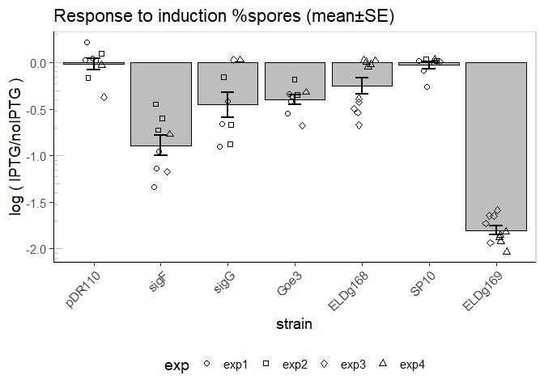
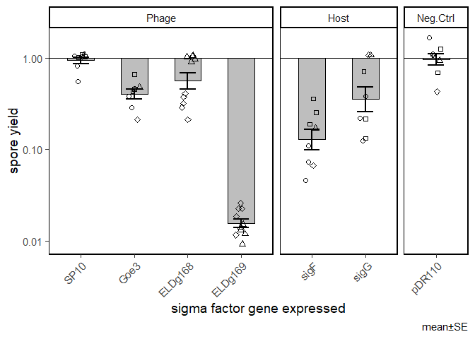

Sporulation assay with IPTG-induced sigma factors
================

**Only consider counts with at least 100 events**

Quantities based on lower event counts are designated a value of 1
cell/mL, to prevent problems with ratio and logs.

# Replication outliers

I have N=3 for each flask at each time point. There are some
measurements which are obviously way off. To get rid of these I will
choose from each triplicate the 2 points that are in best agreement and
remove the 3rd point. There is a function to idenify such a point in
pacakge ‘outliers’ &gt; outlier {outliers} Finds value with largest
difference between it and sample mean, which can be an outlier.

> logical: if set to TRUE, gives vector of logical values, and possible
> outlier position is marked by TRUE

I will apply the outlier filtering on the number of total cells
(veg+spore)

# Overview of results

Concentrations of cell types:
<!-- -->
Remove blanks

## Total cells

    ## `summarise()` has grouped output by 'strain', 'treat', 'colony'. You can override using the `.groups` argument.

    ## `summarise()` has grouped output by 'strain', 'treat', 'colony', 'exp'. You can override using the `.groups` argument.

``` r
# summary(aov(induction.ratio~strain+colony+exp, d.sum.cells))
   

   d.test.cells <- tibble()
# t-tests against control
   for (s in unique(d.sum.cells$strain)){
      for (who in c("spore.ml", "veg.ml", "cells.ml")){
              
          d.test.cells <- d.sum.cells %>% 
               filter(strain == s, pop == who) %>% 
               t.test(quant ~ treat, data = .) %>% 
               broom::tidy() %>% 
               mutate(strain = s, pop = who) %>% 
               bind_rows(d.test.cells, .)
      }

   }
   
# adjust p-value for multiple testing
   d.test.cells <- d.test.cells %>% 
      mutate(adj.p = p.adjust(p.value, method = "BH"),
             p.lab = stars.pval(adj.p)) %>% 
      relocate(strain, p.value, adj.p, p.lab)
   
   #print pretty table
   d.test.cells %>% 
      mutate(strain = str_replace(strain, "pDR110", "Empty Vector")) %>% 
      mutate(pop = case_when(pop=="spore.ml" ~ "Spores",
                             pop=="veg.ml" ~"Vegetative",
                             pop=="cells.ml" ~ "Total Cells")) %>%
      mutate(group1 = "+ IPTG") %>% 
      mutate(group2 = "- IPTG") %>% 
      select( `induced gene` = strain, 
              group1 , group2,
            `Test statistic` = statistic,
            df = parameter, 
            `P value` = p.value, `adjusted P` = adj.p,
            ` ` = p.lab,
            mean_group1 = estimate1, mean_group2 = estimate2,
            method, `Alternative hypothesis` = alternative) %>% 
   pander()
```

| induced gene | group1  | group2  | Test statistic |  df   |  P value  |
|:------------:|:-------:|:-------:|:--------------:|:-----:|:---------:|
| Empty Vector | \+ IPTG | \- IPTG |     0.3105     | 13.64 |  0.7609   |
| Empty Vector | \+ IPTG | \- IPTG |     0.705      | 13.72 |  0.4926   |
| Empty Vector | \+ IPTG | \- IPTG |     0.8578     | 13.74 |  0.4057   |
|     sigF     | \+ IPTG | \- IPTG |     -4.08      | 7.022 | 0.004661  |
|     sigF     | \+ IPTG | \- IPTG |     0.8282     | 7.947 |  0.4318   |
|     sigF     | \+ IPTG | \- IPTG |     -1.415     | 13.47 |  0.1798   |
|     sigG     | \+ IPTG | \- IPTG |     -3.41      | 10.55 | 0.006176  |
|     sigG     | \+ IPTG | \- IPTG |     -2.541     | 12.16 |  0.02565  |
|     sigG     | \+ IPTG | \- IPTG |     -3.803     | 8.613 |  0.00455  |
|     Goe3     | \+ IPTG | \- IPTG |     -4.498     | 10.02 |  0.00114  |
|     Goe3     | \+ IPTG | \- IPTG |     1.085      | 9.623 |  0.3044   |
|     Goe3     | \+ IPTG | \- IPTG |    -0.9488     | 13.2  |  0.3597   |
|   ELDg168    | \+ IPTG | \- IPTG |     -2.729     | 14.54 |  0.01587  |
|   ELDg168    | \+ IPTG | \- IPTG |     1.495      | 17.4  |  0.1529   |
|   ELDg168    | \+ IPTG | \- IPTG |     -1.274     | 17.96 |   0.219   |
|     SP10     | \+ IPTG | \- IPTG |     -2.264     | 10.01 |   0.047   |
|     SP10     | \+ IPTG | \- IPTG |     -2.977     | 13.42 |  0.0104   |
|     SP10     | \+ IPTG | \- IPTG |     -3.382     | 8.437 | 0.008899  |
|   ELDg169    | \+ IPTG | \- IPTG |     -13.72     | 9.001 | 2.445e-07 |
|   ELDg169    | \+ IPTG | \- IPTG |     0.5593     | 17.81 |  0.5829   |
|   ELDg169    | \+ IPTG | \- IPTG |     -3.772     | 14.97 | 0.001854  |

Table continues below

| adjusted P |        | mean\_group1 | mean\_group2 |         method          |
|:----------:|--------|:------------:|:------------:|:-----------------------:|
|   0.7609   |        |   68602023   |   65235084   | Welch Two Sample t-test |
|   0.5445   |        |   84768923   |   73782515   | Welch Two Sample t-test |
|   0.5012   |        |  153370945   |   1.39e+08   | Welch Two Sample t-test |
|  0.01958   | \*     |   4254190    |   70416698   | Welch Two Sample t-test |
|   0.5037   |        |   75991799   |   55042746   | Welch Two Sample t-test |
|   0.2904   |        |   80245989   |  125459444   | Welch Two Sample t-test |
|  0.02162   | \*     |   17693125   |   80488767   | Welch Two Sample t-test |
|  0.05387   | .      |   36782292   |   61873679   | Welch Two Sample t-test |
|  0.01958   | \*     |   54475417   |  142362446   | Welch Two Sample t-test |
|  0.01197   | \*     |   24822030   |   76195647   | Welch Two Sample t-test |
|   0.4262   |        |   99648384   |   76144289   | Welch Two Sample t-test |
|   0.4722   |        |  124470415   |  152339936   | Welch Two Sample t-test |
|  0.03704   | \*     |   52676207   |   88455527   | Welch Two Sample t-test |
|   0.2675   |        |   75917158   |   58298275   | Welch Two Sample t-test |
|   0.3284   |        |  128593365   |  146753802   | Welch Two Sample t-test |
|  0.08972   | .      |   35841667   |   67672664   | Welch Two Sample t-test |
|  0.02729   | \*     |   23703542   |   38446529   | Welch Two Sample t-test |
|   0.0267   | \*     |   59545208   |  106119193   | Welch Two Sample t-test |
| 5.135e-06  | \*\*\* |    580500    |   88628436   | Welch Two Sample t-test |
|   0.6121   |        |   62511500   |   53384571   | Welch Two Sample t-test |
|  0.01298   | \*     |   63092000   |   1.42e+08   | Welch Two Sample t-test |

Table continues below

| Alternative hypothesis |
|:----------------------:|
|       two.sided        |
|       two.sided        |
|       two.sided        |
|       two.sided        |
|       two.sided        |
|       two.sided        |
|       two.sided        |
|       two.sided        |
|       two.sided        |
|       two.sided        |
|       two.sided        |
|       two.sided        |
|       two.sided        |
|       two.sided        |
|       two.sided        |
|       two.sided        |
|       two.sided        |
|       two.sided        |
|       two.sided        |
|       two.sided        |
|       two.sided        |

``` r
   d.test.diffs <- tibble()
# t-tests against control
   for (s in unique(d.diff.cells$strain)){
      for (who in c("spore.ml", "veg.ml", "cells.ml")){
              
          d.test.diffs <- d.diff.cells %>% 
               filter(strain == s, pop == who) %>% 
             pull(diff) %>% 
               t.test(., paired = F, mu = 0) %>% 
               broom::tidy() %>% 
               mutate(strain = s, pop = who) %>% 
               bind_rows(d.test.diffs, .)
      }

   }
   
# adjust p-value for multiple testing
   d.test.diffs <- d.test.diffs %>% 
      mutate(adj.p = p.adjust(p.value, method = "BH"),
             p.lab = stars.pval(adj.p)) %>% 
      relocate(strain, p.value, adj.p, p.lab)
   
     # print pretty table
   d.test.diffs %>% 
      mutate(strain = str_replace(strain, "pDR110", "Empty Vector")) %>% 
       mutate(pop = case_when(pop=="spore.ml" ~ "Spores",
                              pop=="veg.ml" ~"Vegetative",
                              pop=="cells.ml" ~ "Total Cells")) %>%
      mutate(estimate.ci = paste(scientific(estimate),"±",scientific(abs(estimate-conf.low)))) %>% 
    select( `induced gene` = strain, 
            `cell population` = pop,
            `Test statistic` = statistic,
            df = parameter, 
            `P value` = p.value, `adjusted P` = adj.p,
            ` ` = p.lab,
            `mean±CI (noIPTG - IPTG)` = estimate.ci,
            method, `Alternative hypothesis` = alternative) %>% 
         mutate(`induced gene` = fct_relevel(`induced gene`,"Empty Vector","sigF", "sigG","SP10", "Goe3","ELDg168", "ELDg169"))%>%
      mutate(`cell population` = fct_relevel(`cell population`, "Spores","Vegetative", "Total Cells")) %>%
      arrange(`cell population`, `induced gene`) %>% 
   pander()
```

| induced gene | cell population | Test statistic | df  |  P value  | adjusted P |
|:------------:|:---------------:|:--------------:|:---:|:---------:|:----------:|
| Empty Vector |     Spores      |     0.3994     |  7  |  0.7015   |   0.7015   |
|     sigF     |     Spores      |     -4.05      |  7  |  0.00487  |  0.01136   |
|     sigG     |     Spores      |     -5.491     |  7  | 0.0009151 |  0.005003  |
|     SP10     |     Spores      |     -4.402     |  7  | 0.003148  |  0.009444  |
|     Goe3     |     Spores      |     -5.453     |  7  | 0.000953  |  0.005003  |
|   ELDg168    |     Spores      |     -4.114     |  9  | 0.002622  |  0.009444  |
|   ELDg169    |     Spores      |     -13.81     |  9  | 2.302e-07 | 4.834e-06  |
| Empty Vector |   Vegetative    |     1.115      |  7  |  0.3015   |   0.3333   |
|     sigF     |   Vegetative    |     0.7883     |  7  |  0.4564   |   0.4792   |
|     sigG     |   Vegetative    |     -2.341     |  7  |  0.05178  |  0.09062   |
|     SP10     |   Vegetative    |     -2.981     |  7  |  0.0205   |  0.03913   |
|     Goe3     |   Vegetative    |     1.569      |  7  |  0.1607   |   0.2249   |
|   ELDg168    |   Vegetative    |     1.768      |  9  |  0.1108   |   0.179    |
|   ELDg169    |   Vegetative    |     1.368      |  9  |  0.2045   |   0.2526   |
| Empty Vector |   Total Cells   |      1.49      |  7  |  0.1797   |   0.2359   |
|     sigF     |   Total Cells   |     -1.191     |  7  |  0.2723   |   0.3177   |
|     sigG     |   Total Cells   |     -4.109     |  7  | 0.004523  |  0.01136   |
|     SP10     |   Total Cells   |     -4.522     |  7  | 0.002727  |  0.009444  |
|     Goe3     |   Total Cells   |     -1.599     |  7  |  0.1539   |   0.2249   |
|   ELDg168    |   Total Cells   |     -2.896     |  9  |  0.0177   |  0.03718   |
|   ELDg169    |   Total Cells   |     -8.405     |  9  | 1.488e-05 | 0.0001563  |

Table continues below

|        | mean±CI (noIPTG - IPTG) |      method       | Alternative hypothesis |
|--------|:-----------------------:|:-----------------:|:----------------------:|
|        |   3.37e+06 ± 1.99e+07   | One Sample t-test |       two.sided        |
| \*     |  -6.62e+07 ± 3.86e+07   | One Sample t-test |       two.sided        |
| \*\*   |  -6.28e+07 ± 2.70e+07   | One Sample t-test |       two.sided        |
| \*\*   |  -3.18e+07 ± 1.71e+07   | One Sample t-test |       two.sided        |
| \*\*   |  -5.14e+07 ± 2.23e+07   | One Sample t-test |       two.sided        |
| \*\*   |  -3.58e+07 ± 1.97e+07   | One Sample t-test |       two.sided        |
| \*\*\* |  -8.80e+07 ± 1.44e+07   | One Sample t-test |       two.sided        |
|        |   1.10e+07 ± 2.33e+07   | One Sample t-test |       two.sided        |
|        |   2.09e+07 ± 6.28e+07   | One Sample t-test |       two.sided        |
| .      |  -2.51e+07 ± 2.53e+07   | One Sample t-test |       two.sided        |
| \*     |  -1.47e+07 ± 1.17e+07   | One Sample t-test |       two.sided        |
|        |   2.35e+07 ± 3.54e+07   | One Sample t-test |       two.sided        |
|        |   1.76e+07 ± 2.25e+07   | One Sample t-test |       two.sided        |
|        |   9.13e+06 ± 1.51e+07   | One Sample t-test |       two.sided        |
|        |   1.44e+07 ± 2.28e+07   | One Sample t-test |       two.sided        |
|        |  -4.52e+07 ± 8.97e+07   | One Sample t-test |       two.sided        |
| \*     |  -8.79e+07 ± 5.06e+07   | One Sample t-test |       two.sided        |
| \*\*   |  -4.66e+07 ± 2.44e+07   | One Sample t-test |       two.sided        |
|        |  -2.79e+07 ± 4.12e+07   | One Sample t-test |       two.sided        |
| \*     |  -1.82e+07 ± 1.42e+07   | One Sample t-test |       two.sided        |
| \*\*\* |  -7.89e+07 ± 2.12e+07   | One Sample t-test |       two.sided        |

``` r
plot.p <- 
d.test.cells%>% 
   select(strain, pop, p.value, p.lab) %>% 
   
   mutate(strain = str_replace(strain, "pDR110", "Empty Vector")) %>% 
   mutate(strain = fct_relevel(strain,"Empty Vector","sigF", "sigG","SP10", "Goe3","ELDg168", "ELDg169"))%>%
   
      mutate(pop = if_else(pop=="spore.ml", "Spores","Vegetative")) %>%
    mutate(pop = fct_relevel(pop,"Spores", "Vegetative")) %>% 
 
   
      # panel separation
   mutate(pnl=case_when(strain == "Empty Vector" ~ "Neg. Ctrl",
                        strain %in% c("sigF","sigG") ~ "Host",
                        TRUE ~ "Phage") %>% 
             as_factor()) %>% 
   mutate(pnl = fct_relevel(pnl,"Phage", "Host", "Neg. Ctrl")) %>%
   mutate(y = if_else(pop=="Vegetative", -9e7, 9e7)) %>% 
   mutate(p.lab = str_replace(p.lab, "\\.", ""))
```

    ## `summarise()` has grouped output by 'strain', 'treat', 'colony'. You can override using the `.groups` argument.

<!-- -->

<!-- -->

Change in response to induction, log10(IPTG/noIPTG):

<!-- -->

    ## `summarise()` has grouped output by 'strain', 'treat', 'colony', 'pop'. You can override using the `.groups` argument.

<!-- -->

    ## `summarise()` has grouped output by 'strain', 'treat', 'colony'. You can override using the `.groups` argument.

<!-- -->

\#stats on log ratio of % spores

    ## `summarise()` has grouped output by 'strain', 'treat', 'colony'. You can override using the `.groups` argument.

``` r
summary(aov(induction.ratio~strain+colony+exp, d.sum))
```

    ##             Df Sum Sq Mean Sq F value   Pr(>F)    
    ## strain       6  7.421  1.2369  19.119 5.05e-11 ***
    ## colony       4  0.077  0.0193   0.299   0.8774    
    ## exp          3  0.662  0.2206   3.410   0.0251 *  
    ## Residuals   46  2.976  0.0647                     
    ## ---
    ## Signif. codes:  0 '***' 0.001 '**' 0.01 '*' 0.05 '.' 0.1 ' ' 1

``` r
   d.test <- tibble()
# t-tests against control
   for (s in unique(d.sum$strain)){
      if (s =="pDR110") next
      d.test <-d.sum %>% 
         filter(strain == s |strain =="pDR110") %>% 
         t.test(induction.ratio ~ strain, data = .) %>% 
         broom::tidy() %>% 
         mutate(strain = s) %>% 
         bind_rows(d.test, .)
   }
   
# adjust p-value for multiple testing
   d.test <- d.test %>% 
      mutate(adj.p = p.adjust(p.value, method = "BH"),
             p.lab = stars.pval(adj.p)) %>% 
      relocate(strain, p.value, adj.p, p.lab)
   
   # print pretty table
   d.test %>%
      mutate(estimate.ci = paste(signif(estimate,3),"±",signif(abs(estimate-conf.low),3))) %>% 
    mutate(group2 = "Empty Vector") %>% 
      select( group1 = strain, group2,
            `Test statistic` = statistic,
            df = parameter, 
            `P value` = p.value, `adjusted P` = adj.p,
            ` ` = p.lab,
            mean_group1 = estimate2, mean_group2 = estimate1,
            `difference in means±CI` = estimate.ci,
            method, `Alternative hypothesis` = alternative) %>% 
      mutate(group1 = fct_relevel(group1,"sigF", "sigG","ELDg168","ELDg169","Goe3","SP10"))%>%
      arrange(group1) %>% 
   pander()
```

| group1  |    group2    | Test statistic |  df   |  P value  | adjusted P |        |
|:-------:|:------------:|:--------------:|:-----:|:---------:|:----------:|--------|
|  sigF   | Empty Vector |     6.432      | 8.199 | 0.0001818 | 0.0005453  | \*\*\* |
|  sigG   | Empty Vector |     2.769      | 13.86 |  0.01519  |  0.02279   | \*     |
| ELDg168 | Empty Vector |     2.097      | 15.12 |  0.05324  |  0.06389   | .      |
| ELDg169 | Empty Vector |     7.802      | 7.003 | 0.0001067 | 0.0005453  | \*\*\* |
|  Goe3   | Empty Vector |     4.387      | 8.864 | 0.001818  |  0.003635  | \*\*   |
|  SP10   | Empty Vector |     0.4636     | 10.36 |  0.6525   |   0.6525   |        |

Table continues below

| mean\_group1 | mean\_group2 | difference in means±CI |         method          |
|:------------:|:------------:|:----------------------:|:-----------------------:|
|    0.1585    |    1.024     |     0.865 ± 0.309      | Welch Two Sample t-test |
|    0.4906    |    1.024     |     0.533 ± 0.413      | Welch Two Sample t-test |
|    0.6611    |    1.024     |     0.363 ± 0.368      | Welch Two Sample t-test |
|   0.01658    |    1.024     |      1.01 ± 0.305      | Welch Two Sample t-test |
|    0.4203    |    1.024     |     0.603 ± 0.312      | Welch Two Sample t-test |
|    0.9567    |    1.024     |     0.067 ± 0.321      | Welch Two Sample t-test |

Table continues below

| Alternative hypothesis |
|:----------------------:|
|       two.sided        |
|       two.sided        |
|       two.sided        |
|       two.sided        |
|       two.sided        |
|       two.sided        |

    ## `summarise()` has grouped output by 'strain', 'treat', 'colony'. You can override using the `.groups` argument.

<!-- -->

# ms plot

    ## `summarise()` has grouped output by 'strain', 'treat', 'colony'. You can override using the `.groups` argument.

    ## Warning: Ignoring unknown parameters: width

<!-- -->

<!-- -->

    ## `summarise()` has grouped output by 'strain', 'treat', 'colony'. You can override using the `.groups` argument.

<!-- -->
