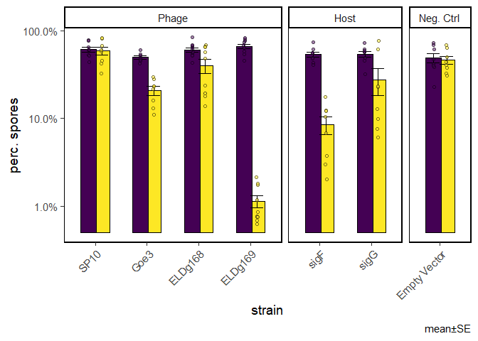

Sporulation assay with IPTG-induced sigma factors
================

**Only consider counts with at least 100 events**

Quantities based on lower event counts are designated a value of 1
cell/mL, to prevent problems with ratio and logs.

# Replication outliers

I have N=3 for each flask at each time point. There are some
measurements which are obviously way off. To get rid of these I will
choose from each triplicate the 2 points that are in best agreement and
remove the 3rd point. There is a function to idenify such a point in
pacakge ‘outliers’ &gt; outlier {outliers} Finds value with largest
difference between it and sample mean, which can be an outlier.

> logical: if set to TRUE, gives vector of logical values, and possible
> outlier position is marked by TRUE

I will apply the outlier filtering on the number of total cells
(veg+spore)

# Overview of results

Concentrations of cell types:
<!-- -->
Remove blanks

## Total cells

    ## `summarise()` has grouped output by 'strain', 'treat', 'colony'. You can override using the `.groups` argument.

    ## `summarise()` has grouped output by 'strain', 'treat', 'colony', 'exp'. You can override using the `.groups` argument.

``` r
# summary(aov(induction.ratio~strain+colony+exp, d.sum.cells))
   

   d.test.cells <- tibble()
# t-tests against control
   for (s in unique(d.sum.cells$strain)){
      for (who in c("spore.ml", "veg.ml", "cells.ml")){
              
          d.test.cells <- d.sum.cells %>% 
               filter(strain == s, pop == who) %>% 
               t.test(quant ~ treat, data = .) %>% 
               broom::tidy() %>% 
               mutate(strain = s, pop = who) %>% 
               bind_rows(d.test.cells, .)
      }

   }
   
# adjust p-value for multiple testing
   d.test.cells <- d.test.cells %>% 
      mutate(adj.p = p.adjust(p.value, method = "BH"),
             p.lab = stars.pval(adj.p)) %>% 
      relocate(strain, p.value, adj.p, p.lab)
   
   knitr::kable(d.test.cells, format = "html")
```

<table>
<thead>
<tr>
<th style="text-align:left;">
strain
</th>
<th style="text-align:right;">
p.value
</th>
<th style="text-align:right;">
adj.p
</th>
<th style="text-align:left;">
p.lab
</th>
<th style="text-align:right;">
estimate
</th>
<th style="text-align:right;">
estimate1
</th>
<th style="text-align:right;">
estimate2
</th>
<th style="text-align:right;">
statistic
</th>
<th style="text-align:right;">
parameter
</th>
<th style="text-align:right;">
conf.low
</th>
<th style="text-align:right;">
conf.high
</th>
<th style="text-align:left;">
method
</th>
<th style="text-align:left;">
alternative
</th>
<th style="text-align:left;">
pop
</th>
</tr>
</thead>
<tbody>
<tr>
<td style="text-align:left;">
pDR110
</td>
<td style="text-align:right;">
0.7608707
</td>
<td style="text-align:right;">
0.7608707
</td>
<td style="text-align:left;">
</td>
<td style="text-align:right;">
3366939
</td>
<td style="text-align:right;">
68602022.8
</td>
<td style="text-align:right;">
65235084
</td>
<td style="text-align:right;">
0.3105044
</td>
<td style="text-align:right;">
13.641586
</td>
<td style="text-align:right;">
-19947404
</td>
<td style="text-align:right;">
26681282.4
</td>
<td style="text-align:left;">
Welch Two Sample t-test
</td>
<td style="text-align:left;">
two.sided
</td>
<td style="text-align:left;">
spore.ml
</td>
</tr>
<tr>
<td style="text-align:left;">
pDR110
</td>
<td style="text-align:right;">
0.4926153
</td>
<td style="text-align:right;">
0.5444695
</td>
<td style="text-align:left;">
</td>
<td style="text-align:right;">
10986407
</td>
<td style="text-align:right;">
84768922.5
</td>
<td style="text-align:right;">
73782515
</td>
<td style="text-align:right;">
0.7049831
</td>
<td style="text-align:right;">
13.720975
</td>
<td style="text-align:right;">
-22501678
</td>
<td style="text-align:right;">
44474492.5
</td>
<td style="text-align:left;">
Welch Two Sample t-test
</td>
<td style="text-align:left;">
two.sided
</td>
<td style="text-align:left;">
veg.ml
</td>
</tr>
<tr>
<td style="text-align:left;">
pDR110
</td>
<td style="text-align:right;">
0.4056975
</td>
<td style="text-align:right;">
0.5011557
</td>
<td style="text-align:left;">
</td>
<td style="text-align:right;">
14353346
</td>
<td style="text-align:right;">
153370945\.3
</td>
<td style="text-align:right;">
139017599
</td>
<td style="text-align:right;">
0.8578353
</td>
<td style="text-align:right;">
13.741319
</td>
<td style="text-align:right;">
-21596822
</td>
<td style="text-align:right;">
50303515.0
</td>
<td style="text-align:left;">
Welch Two Sample t-test
</td>
<td style="text-align:left;">
two.sided
</td>
<td style="text-align:left;">
cells.ml
</td>
</tr>
<tr>
<td style="text-align:left;">
sigF
</td>
<td style="text-align:right;">
0.0046611
</td>
<td style="text-align:right;">
0.0195768
</td>
<td style="text-align:left;">

-   </td>
    <td style="text-align:right;">
    -66162507
    </td>
    <td style="text-align:right;">
    4254190.3
    </td>
    <td style="text-align:right;">
    70416698
    </td>
    <td style="text-align:right;">
    -4.0796489
    </td>
    <td style="text-align:right;">
    7.021647
    </td>
    <td style="text-align:right;">
    -104487312
    </td>
    <td style="text-align:right;">
    -27837702.3
    </td>
    <td style="text-align:left;">
    Welch Two Sample t-test
    </td>
    <td style="text-align:left;">
    two.sided
    </td>
    <td style="text-align:left;">
    spore.ml
    </td>
    </tr>
    <tr>
    <td style="text-align:left;">
    sigF
    </td>
    <td style="text-align:right;">
    0.4317514
    </td>
    <td style="text-align:right;">
    0.5037100
    </td>
    <td style="text-align:left;">
    </td>
    <td style="text-align:right;">
    20949053
    </td>
    <td style="text-align:right;">
    75991799.0
    </td>
    <td style="text-align:right;">
    55042746
    </td>
    <td style="text-align:right;">
    0.8281503
    </td>
    <td style="text-align:right;">
    7.946891
    </td>
    <td style="text-align:right;">
    -37452010
    </td>
    <td style="text-align:right;">
    79350116.1
    </td>
    <td style="text-align:left;">
    Welch Two Sample t-test
    </td>
    <td style="text-align:left;">
    two.sided
    </td>
    <td style="text-align:left;">
    veg.ml
    </td>
    </tr>
    <tr>
    <td style="text-align:left;">
    sigF
    </td>
    <td style="text-align:right;">
    0.1797892
    </td>
    <td style="text-align:right;">
    0.2904288
    </td>
    <td style="text-align:left;">
    </td>
    <td style="text-align:right;">
    -45213454
    </td>
    <td style="text-align:right;">
    80245989.3
    </td>
    <td style="text-align:right;">
    125459444
    </td>
    <td style="text-align:right;">
    -1.4149362
    </td>
    <td style="text-align:right;">
    13.468993
    </td>
    <td style="text-align:right;">
    -114003208
    </td>
    <td style="text-align:right;">
    23576299.7
    </td>
    <td style="text-align:left;">
    Welch Two Sample t-test
    </td>
    <td style="text-align:left;">
    two.sided
    </td>
    <td style="text-align:left;">
    cells.ml
    </td>
    </tr>
    <tr>
    <td style="text-align:left;">
    sigG
    </td>
    <td style="text-align:right;">
    0.0061758
    </td>
    <td style="text-align:right;">
    0.0216155
    </td>
    <td style="text-align:left;">

    -   </td>
        <td style="text-align:right;">
        -62795642
        </td>
        <td style="text-align:right;">
        17693125.0
        </td>
        <td style="text-align:right;">
        80488767
        </td>
        <td style="text-align:right;">
        -3.4100758
        </td>
        <td style="text-align:right;">
        10.546610
        </td>
        <td style="text-align:right;">
        -103539799
        </td>
        <td style="text-align:right;">
        -22051485.2
        </td>
        <td style="text-align:left;">
        Welch Two Sample t-test
        </td>
        <td style="text-align:left;">
        two.sided
        </td>
        <td style="text-align:left;">
        spore.ml
        </td>
        </tr>
        <tr>
        <td style="text-align:left;">
        sigG
        </td>
        <td style="text-align:right;">
        0.0256526
        </td>
        <td style="text-align:right;">
        0.0538704
        </td>
        <td style="text-align:left;">
        .
        </td>
        <td style="text-align:right;">
        -25091387
        </td>
        <td style="text-align:right;">
        36782291.7
        </td>
        <td style="text-align:right;">
        61873679
        </td>
        <td style="text-align:right;">
        -2.5412320
        </td>
        <td style="text-align:right;">
        12.164627
        </td>
        <td style="text-align:right;">
        -46572107
        </td>
        <td style="text-align:right;">
        -3610667.4
        </td>
        <td style="text-align:left;">
        Welch Two Sample t-test
        </td>
        <td style="text-align:left;">
        two.sided
        </td>
        <td style="text-align:left;">
        veg.ml
        </td>
        </tr>
        <tr>
        <td style="text-align:left;">
        sigG
        </td>
        <td style="text-align:right;">
        0.0045500
        </td>
        <td style="text-align:right;">
        0.0195768
        </td>
        <td style="text-align:left;">

        -   </td>
            <td style="text-align:right;">
            -87887029
            </td>
            <td style="text-align:right;">
            54475416.7
            </td>
            <td style="text-align:right;">
            142362446
            </td>
            <td style="text-align:right;">
            -3.8030003
            </td>
            <td style="text-align:right;">
            8.613020
            </td>
            <td style="text-align:right;">
            -140525547
            </td>
            <td style="text-align:right;">
            -35248512.0
            </td>
            <td style="text-align:left;">
            Welch Two Sample t-test
            </td>
            <td style="text-align:left;">
            two.sided
            </td>
            <td style="text-align:left;">
            cells.ml
            </td>
            </tr>
            <tr>
            <td style="text-align:left;">
            Goe3
            </td>
            <td style="text-align:right;">
            0.0011403
            </td>
            <td style="text-align:right;">
            0.0119730
            </td>
            <td style="text-align:left;">

            -   </td>
                <td style="text-align:right;">
                -51373617
                </td>
                <td style="text-align:right;">
                24822030.4
                </td>
                <td style="text-align:right;">
                76195647
                </td>
                <td style="text-align:right;">
                -4.4980281
                </td>
                <td style="text-align:right;">
                10.022092
                </td>
                <td style="text-align:right;">
                -76814400
                </td>
                <td style="text-align:right;">
                -25932833.4
                </td>
                <td style="text-align:left;">
                Welch Two Sample t-test
                </td>
                <td style="text-align:left;">
                two.sided
                </td>
                <td style="text-align:left;">
                spore.ml
                </td>
                </tr>
                <tr>
                <td style="text-align:left;">
                Goe3
                </td>
                <td style="text-align:right;">
                0.3044136
                </td>
                <td style="text-align:right;">
                0.4261791
                </td>
                <td style="text-align:left;">
                </td>
                <td style="text-align:right;">
                23504095
                </td>
                <td style="text-align:right;">
                99648384.2
                </td>
                <td style="text-align:right;">
                76144289
                </td>
                <td style="text-align:right;">
                1.0848568
                </td>
                <td style="text-align:right;">
                9.623492
                </td>
                <td style="text-align:right;">
                -25027148
                </td>
                <td style="text-align:right;">
                72035338.5
                </td>
                <td style="text-align:left;">
                Welch Two Sample t-test
                </td>
                <td style="text-align:left;">
                two.sided
                </td>
                <td style="text-align:left;">
                veg.ml
                </td>
                </tr>
                <tr>
                <td style="text-align:left;">
                Goe3
                </td>
                <td style="text-align:right;">
                0.3597437
                </td>
                <td style="text-align:right;">
                0.4721635
                </td>
                <td style="text-align:left;">
                </td>
                <td style="text-align:right;">
                -27869522
                </td>
                <td style="text-align:right;">
                124470414\.6
                </td>
                <td style="text-align:right;">
                152339936
                </td>
                <td style="text-align:right;">
                -0.9488470
                </td>
                <td style="text-align:right;">
                13.203162
                </td>
                <td style="text-align:right;">
                -91224733
                </td>
                <td style="text-align:right;">
                35485689.7
                </td>
                <td style="text-align:left;">
                Welch Two Sample t-test
                </td>
                <td style="text-align:left;">
                two.sided
                </td>
                <td style="text-align:left;">
                cells.ml
                </td>
                </tr>
                <tr>
                <td style="text-align:left;">
                ELDg168
                </td>
                <td style="text-align:right;">
                0.0158732
                </td>
                <td style="text-align:right;">
                0.0370374
                </td>
                <td style="text-align:left;">

                -   </td>
                    <td style="text-align:right;">
                    -35779320
                    </td>
                    <td style="text-align:right;">
                    52676206.6
                    </td>
                    <td style="text-align:right;">
                    88455527
                    </td>
                    <td style="text-align:right;">
                    -2.7288230
                    </td>
                    <td style="text-align:right;">
                    14.542752
                    </td>
                    <td style="text-align:right;">
                    -63802826
                    </td>
                    <td style="text-align:right;">
                    -7755814.1
                    </td>
                    <td style="text-align:left;">
                    Welch Two Sample t-test
                    </td>
                    <td style="text-align:left;">
                    two.sided
                    </td>
                    <td style="text-align:left;">
                    spore.ml
                    </td>
                    </tr>
                    <tr>
                    <td style="text-align:left;">
                    ELDg168
                    </td>
                    <td style="text-align:right;">
                    0.1528853
                    </td>
                    <td style="text-align:right;">
                    0.2675494
                    </td>
                    <td style="text-align:left;">
                    </td>
                    <td style="text-align:right;">
                    17618883
                    </td>
                    <td style="text-align:right;">
                    75917158.3
                    </td>
                    <td style="text-align:right;">
                    58298275
                    </td>
                    <td style="text-align:right;">
                    1.4947666
                    </td>
                    <td style="text-align:right;">
                    17.404877
                    </td>
                    <td style="text-align:right;">
                    -7205616
                    </td>
                    <td style="text-align:right;">
                    42443383.0
                    </td>
                    <td style="text-align:left;">
                    Welch Two Sample t-test
                    </td>
                    <td style="text-align:left;">
                    two.sided
                    </td>
                    <td style="text-align:left;">
                    veg.ml
                    </td>
                    </tr>
                    <tr>
                    <td style="text-align:left;">
                    ELDg168
                    </td>
                    <td style="text-align:right;">
                    0.2189644
                    </td>
                    <td style="text-align:right;">
                    0.3284466
                    </td>
                    <td style="text-align:left;">
                    </td>
                    <td style="text-align:right;">
                    -18160437
                    </td>
                    <td style="text-align:right;">
                    128593364\.9
                    </td>
                    <td style="text-align:right;">
                    146753802
                    </td>
                    <td style="text-align:right;">
                    -1.2738204
                    </td>
                    <td style="text-align:right;">
                    17.961429
                    </td>
                    <td style="text-align:right;">
                    -48117200
                    </td>
                    <td style="text-align:right;">
                    11796326.7
                    </td>
                    <td style="text-align:left;">
                    Welch Two Sample t-test
                    </td>
                    <td style="text-align:left;">
                    two.sided
                    </td>
                    <td style="text-align:left;">
                    cells.ml
                    </td>
                    </tr>
                    <tr>
                    <td style="text-align:left;">
                    SP10
                    </td>
                    <td style="text-align:right;">
                    0.0469974
                    </td>
                    <td style="text-align:right;">
                    0.0897222
                    </td>
                    <td style="text-align:left;">
                    .
                    </td>
                    <td style="text-align:right;">
                    -31830997
                    </td>
                    <td style="text-align:right;">
                    35841666.7
                    </td>
                    <td style="text-align:right;">
                    67672664
                    </td>
                    <td style="text-align:right;">
                    -2.2644189
                    </td>
                    <td style="text-align:right;">
                    10.006756
                    </td>
                    <td style="text-align:right;">
                    -63149139
                    </td>
                    <td style="text-align:right;">
                    -512855.3
                    </td>
                    <td style="text-align:left;">
                    Welch Two Sample t-test
                    </td>
                    <td style="text-align:left;">
                    two.sided
                    </td>
                    <td style="text-align:left;">
                    spore.ml
                    </td>
                    </tr>
                    <tr>
                    <td style="text-align:left;">
                    SP10
                    </td>
                    <td style="text-align:right;">
                    0.0103969
                    </td>
                    <td style="text-align:right;">
                    0.0272920
                    </td>
                    <td style="text-align:left;">

                    -   </td>
                        <td style="text-align:right;">
                        -14742987
                        </td>
                        <td style="text-align:right;">
                        23703541.7
                        </td>
                        <td style="text-align:right;">
                        38446529
                        </td>
                        <td style="text-align:right;">
                        -2.9766212
                        </td>
                        <td style="text-align:right;">
                        13.421626
                        </td>
                        <td style="text-align:right;">
                        -25409067
                        </td>
                        <td style="text-align:right;">
                        -4076908.0
                        </td>
                        <td style="text-align:left;">
                        Welch Two Sample t-test
                        </td>
                        <td style="text-align:left;">
                        two.sided
                        </td>
                        <td style="text-align:left;">
                        veg.ml
                        </td>
                        </tr>
                        <tr>
                        <td style="text-align:left;">
                        SP10
                        </td>
                        <td style="text-align:right;">
                        0.0088990
                        </td>
                        <td style="text-align:right;">
                        0.0266971
                        </td>
                        <td style="text-align:left;">

                        -   </td>
                            <td style="text-align:right;">
                            -46573984
                            </td>
                            <td style="text-align:right;">
                            59545208.3
                            </td>
                            <td style="text-align:right;">
                            106119193
                            </td>
                            <td style="text-align:right;">
                            -3.3816366
                            </td>
                            <td style="text-align:right;">
                            8.436656
                            </td>
                            <td style="text-align:right;">
                            -78049834
                            </td>
                            <td style="text-align:right;">
                            -15098135.1
                            </td>
                            <td style="text-align:left;">
                            Welch Two Sample t-test
                            </td>
                            <td style="text-align:left;">
                            two.sided
                            </td>
                            <td style="text-align:left;">
                            cells.ml
                            </td>
                            </tr>
                            <tr>
                            <td style="text-align:left;">
                            ELDg169
                            </td>
                            <td style="text-align:right;">
                            0.0000002
                            </td>
                            <td style="text-align:right;">
                            0.0000051
                            </td>
                            <td style="text-align:left;">
                            \*\*\*
                            </td>
                            <td style="text-align:right;">
                            -88047936
                            </td>
                            <td style="text-align:right;">
                            580500.1
                            </td>
                            <td style="text-align:right;">
                            88628436
                            </td>
                            <td style="text-align:right;">
                            -13.7156838
                            </td>
                            <td style="text-align:right;">
                            9.001148
                            </td>
                            <td style="text-align:right;">
                            -102569589
                            </td>
                            <td style="text-align:right;">
                            -73526283.1
                            </td>
                            <td style="text-align:left;">
                            Welch Two Sample t-test
                            </td>
                            <td style="text-align:left;">
                            two.sided
                            </td>
                            <td style="text-align:left;">
                            spore.ml
                            </td>
                            </tr>
                            <tr>
                            <td style="text-align:left;">
                            ELDg169
                            </td>
                            <td style="text-align:right;">
                            0.5829438
                            </td>
                            <td style="text-align:right;">
                            0.6120909
                            </td>
                            <td style="text-align:left;">
                            </td>
                            <td style="text-align:right;">
                            9126929
                            </td>
                            <td style="text-align:right;">
                            62511500.0
                            </td>
                            <td style="text-align:right;">
                            53384571
                            </td>
                            <td style="text-align:right;">
                            0.5592683
                            </td>
                            <td style="text-align:right;">
                            17.810422
                            </td>
                            <td style="text-align:right;">
                            -25185060
                            </td>
                            <td style="text-align:right;">
                            43438917.5
                            </td>
                            <td style="text-align:left;">
                            Welch Two Sample t-test
                            </td>
                            <td style="text-align:left;">
                            two.sided
                            </td>
                            <td style="text-align:left;">
                            veg.ml
                            </td>
                            </tr>
                            <tr>
                            <td style="text-align:left;">
                            ELDg169
                            </td>
                            <td style="text-align:right;">
                            0.0018539
                            </td>
                            <td style="text-align:right;">
                            0.0129776
                            </td>
                            <td style="text-align:left;">

                            -   </td>
                                <td style="text-align:right;">
                                -78921007
                                </td>
                                <td style="text-align:right;">
                                63092000.0
                                </td>
                                <td style="text-align:right;">
                                142013007
                                </td>
                                <td style="text-align:right;">
                                -3.7716981
                                </td>
                                <td style="text-align:right;">
                                14.965072
                                </td>
                                <td style="text-align:right;">
                                -123529653
                                </td>
                                <td style="text-align:right;">
                                -34312361.1
                                </td>
                                <td style="text-align:left;">
                                Welch Two Sample t-test
                                </td>
                                <td style="text-align:left;">
                                two.sided
                                </td>
                                <td style="text-align:left;">
                                cells.ml
                                </td>
                                </tr>
                                </tbody>
                                </table>

``` r
   d.test.diffs <- tibble()
# t-tests against control
   for (s in unique(d.diff.cells$strain)){
      for (who in c("spore.ml", "veg.ml", "cells.ml")){
              
          d.test.diffs <- d.diff.cells %>% 
               filter(strain == s, pop == who) %>% 
             pull(diff) %>% 
               t.test(., paired = F, mu = 0) %>% 
               broom::tidy() %>% 
               mutate(strain = s, pop = who) %>% 
               bind_rows(d.test.diffs, .)
      }

   }
   
# adjust p-value for multiple testing
   d.test.diffs <- d.test.diffs %>% 
      mutate(adj.p = p.adjust(p.value, method = "BH"),
             p.lab = stars.pval(adj.p)) %>% 
      relocate(strain, p.value, adj.p, p.lab)
   
   knitr::kable(d.test.diffs, format = "html")
```

<table>
<thead>
<tr>
<th style="text-align:left;">
strain
</th>
<th style="text-align:right;">
p.value
</th>
<th style="text-align:right;">
adj.p
</th>
<th style="text-align:left;">
p.lab
</th>
<th style="text-align:right;">
estimate
</th>
<th style="text-align:right;">
statistic
</th>
<th style="text-align:right;">
parameter
</th>
<th style="text-align:right;">
conf.low
</th>
<th style="text-align:right;">
conf.high
</th>
<th style="text-align:left;">
method
</th>
<th style="text-align:left;">
alternative
</th>
<th style="text-align:left;">
pop
</th>
</tr>
</thead>
<tbody>
<tr>
<td style="text-align:left;">
ELDg168
</td>
<td style="text-align:right;">
0.0026220
</td>
<td style="text-align:right;">
0.0094435
</td>
<td style="text-align:left;">
\*\*
</td>
<td style="text-align:right;">
35779320
</td>
<td style="text-align:right;">
4.1138134
</td>
<td style="text-align:right;">
9
</td>
<td style="text-align:right;">
16104522.8
</td>
<td style="text-align:right;">
55454118
</td>
<td style="text-align:left;">
One Sample t-test
</td>
<td style="text-align:left;">
two.sided
</td>
<td style="text-align:left;">
spore.ml
</td>
</tr>
<tr>
<td style="text-align:left;">
ELDg168
</td>
<td style="text-align:right;">
0.1108336
</td>
<td style="text-align:right;">
0.1790389
</td>
<td style="text-align:left;">
</td>
<td style="text-align:right;">
-17618883
</td>
<td style="text-align:right;">
-1.7681258
</td>
<td style="text-align:right;">
9
</td>
<td style="text-align:right;">
-40160651.7
</td>
<td style="text-align:right;">
4922885
</td>
<td style="text-align:left;">
One Sample t-test
</td>
<td style="text-align:left;">
two.sided
</td>
<td style="text-align:left;">
veg.ml
</td>
</tr>
<tr>
<td style="text-align:left;">
ELDg168
</td>
<td style="text-align:right;">
0.0177043
</td>
<td style="text-align:right;">
0.0371790
</td>
<td style="text-align:left;">

-   </td>
    <td style="text-align:right;">
    18160437
    </td>
    <td style="text-align:right;">
    2.8962104
    </td>
    <td style="text-align:right;">
    9
    </td>
    <td style="text-align:right;">
    3975776.2
    </td>
    <td style="text-align:right;">
    32345097
    </td>
    <td style="text-align:left;">
    One Sample t-test
    </td>
    <td style="text-align:left;">
    two.sided
    </td>
    <td style="text-align:left;">
    cells.ml
    </td>
    </tr>
    <tr>
    <td style="text-align:left;">
    ELDg169
    </td>
    <td style="text-align:right;">
    0.0000002
    </td>
    <td style="text-align:right;">
    0.0000048
    </td>
    <td style="text-align:left;">
    \*\*\*
    </td>
    <td style="text-align:right;">
    88047936
    </td>
    <td style="text-align:right;">
    13.8138861
    </td>
    <td style="text-align:right;">
    9
    </td>
    <td style="text-align:right;">
    73629236.7
    </td>
    <td style="text-align:right;">
    102466635
    </td>
    <td style="text-align:left;">
    One Sample t-test
    </td>
    <td style="text-align:left;">
    two.sided
    </td>
    <td style="text-align:left;">
    spore.ml
    </td>
    </tr>
    <tr>
    <td style="text-align:left;">
    ELDg169
    </td>
    <td style="text-align:right;">
    0.2044750
    </td>
    <td style="text-align:right;">
    0.2525868
    </td>
    <td style="text-align:left;">
    </td>
    <td style="text-align:right;">
    -9126929
    </td>
    <td style="text-align:right;">
    -1.3680582
    </td>
    <td style="text-align:right;">
    9
    </td>
    <td style="text-align:right;">
    -24218792.6
    </td>
    <td style="text-align:right;">
    5964935
    </td>
    <td style="text-align:left;">
    One Sample t-test
    </td>
    <td style="text-align:left;">
    two.sided
    </td>
    <td style="text-align:left;">
    veg.ml
    </td>
    </tr>
    <tr>
    <td style="text-align:left;">
    ELDg169
    </td>
    <td style="text-align:right;">
    0.0000149
    </td>
    <td style="text-align:right;">
    0.0001563
    </td>
    <td style="text-align:left;">
    \*\*\*
    </td>
    <td style="text-align:right;">
    78921007
    </td>
    <td style="text-align:right;">
    8.4054144
    </td>
    <td style="text-align:right;">
    9
    </td>
    <td style="text-align:right;">
    57680921.3
    </td>
    <td style="text-align:right;">
    100161092
    </td>
    <td style="text-align:left;">
    One Sample t-test
    </td>
    <td style="text-align:left;">
    two.sided
    </td>
    <td style="text-align:left;">
    cells.ml
    </td>
    </tr>
    <tr>
    <td style="text-align:left;">
    pDR110
    </td>
    <td style="text-align:right;">
    0.7015039
    </td>
    <td style="text-align:right;">
    0.7015039
    </td>
    <td style="text-align:left;">
    </td>
    <td style="text-align:right;">
    -3366939
    </td>
    <td style="text-align:right;">
    -0.3993999
    </td>
    <td style="text-align:right;">
    7
    </td>
    <td style="text-align:right;">
    -23300709.1
    </td>
    <td style="text-align:right;">
    16566831
    </td>
    <td style="text-align:left;">
    One Sample t-test
    </td>
    <td style="text-align:left;">
    two.sided
    </td>
    <td style="text-align:left;">
    spore.ml
    </td>
    </tr>
    <tr>
    <td style="text-align:left;">
    pDR110
    </td>
    <td style="text-align:right;">
    0.3015426
    </td>
    <td style="text-align:right;">
    0.3332839
    </td>
    <td style="text-align:left;">
    </td>
    <td style="text-align:right;">
    -10986407
    </td>
    <td style="text-align:right;">
    -1.1152972
    </td>
    <td style="text-align:right;">
    7
    </td>
    <td style="text-align:right;">
    -34279503.5
    </td>
    <td style="text-align:right;">
    12306689
    </td>
    <td style="text-align:left;">
    One Sample t-test
    </td>
    <td style="text-align:left;">
    two.sided
    </td>
    <td style="text-align:left;">
    veg.ml
    </td>
    </tr>
    <tr>
    <td style="text-align:left;">
    pDR110
    </td>
    <td style="text-align:right;">
    0.1797245
    </td>
    <td style="text-align:right;">
    0.2358884
    </td>
    <td style="text-align:left;">
    </td>
    <td style="text-align:right;">
    -14353346
    </td>
    <td style="text-align:right;">
    -1.4904523
    </td>
    <td style="text-align:right;">
    7
    </td>
    <td style="text-align:right;">
    -37125138.8
    </td>
    <td style="text-align:right;">
    8418446
    </td>
    <td style="text-align:left;">
    One Sample t-test
    </td>
    <td style="text-align:left;">
    two.sided
    </td>
    <td style="text-align:left;">
    cells.ml
    </td>
    </tr>
    <tr>
    <td style="text-align:left;">
    sigF
    </td>
    <td style="text-align:right;">
    0.0048699
    </td>
    <td style="text-align:right;">
    0.0113632
    </td>
    <td style="text-align:left;">

    -   </td>
        <td style="text-align:right;">
        66162507
        </td>
        <td style="text-align:right;">
        4.0501418
        </td>
        <td style="text-align:right;">
        7
        </td>
        <td style="text-align:right;">
        27534361.5
        </td>
        <td style="text-align:right;">
        104790653
        </td>
        <td style="text-align:left;">
        One Sample t-test
        </td>
        <td style="text-align:left;">
        two.sided
        </td>
        <td style="text-align:left;">
        spore.ml
        </td>
        </tr>
        <tr>
        <td style="text-align:left;">
        sigF
        </td>
        <td style="text-align:right;">
        0.4563978
        </td>
        <td style="text-align:right;">
        0.4792177
        </td>
        <td style="text-align:left;">
        </td>
        <td style="text-align:right;">
        -20949053
        </td>
        <td style="text-align:right;">
        -0.7882721
        </td>
        <td style="text-align:right;">
        7
        </td>
        <td style="text-align:right;">
        -83791111.7
        </td>
        <td style="text-align:right;">
        41893006
        </td>
        <td style="text-align:left;">
        One Sample t-test
        </td>
        <td style="text-align:left;">
        two.sided
        </td>
        <td style="text-align:left;">
        veg.ml
        </td>
        </tr>
        <tr>
        <td style="text-align:left;">
        sigF
        </td>
        <td style="text-align:right;">
        0.2723485
        </td>
        <td style="text-align:right;">
        0.3177399
        </td>
        <td style="text-align:left;">
        </td>
        <td style="text-align:right;">
        45213454
        </td>
        <td style="text-align:right;">
        1.1913241
        </td>
        <td style="text-align:right;">
        7
        </td>
        <td style="text-align:right;">
        -44529406.3
        </td>
        <td style="text-align:right;">
        134956315
        </td>
        <td style="text-align:left;">
        One Sample t-test
        </td>
        <td style="text-align:left;">
        two.sided
        </td>
        <td style="text-align:left;">
        cells.ml
        </td>
        </tr>
        <tr>
        <td style="text-align:left;">
        sigG
        </td>
        <td style="text-align:right;">
        0.0009151
        </td>
        <td style="text-align:right;">
        0.0050030
        </td>
        <td style="text-align:left;">
        \*\*
        </td>
        <td style="text-align:right;">
        62795642
        </td>
        <td style="text-align:right;">
        5.4911470
        </td>
        <td style="text-align:right;">
        7
        </td>
        <td style="text-align:right;">
        35754279.5
        </td>
        <td style="text-align:right;">
        89837005
        </td>
        <td style="text-align:left;">
        One Sample t-test
        </td>
        <td style="text-align:left;">
        two.sided
        </td>
        <td style="text-align:left;">
        spore.ml
        </td>
        </tr>
        <tr>
        <td style="text-align:left;">
        sigG
        </td>
        <td style="text-align:right;">
        0.0517814
        </td>
        <td style="text-align:right;">
        0.0906174
        </td>
        <td style="text-align:left;">
        .
        </td>
        <td style="text-align:right;">
        25091387
        </td>
        <td style="text-align:right;">
        2.3408338
        </td>
        <td style="text-align:right;">
        7
        </td>
        <td style="text-align:right;">
        -255009.4
        </td>
        <td style="text-align:right;">
        50437784
        </td>
        <td style="text-align:left;">
        One Sample t-test
        </td>
        <td style="text-align:left;">
        two.sided
        </td>
        <td style="text-align:left;">
        veg.ml
        </td>
        </tr>
        <tr>
        <td style="text-align:left;">
        sigG
        </td>
        <td style="text-align:right;">
        0.0045228
        </td>
        <td style="text-align:right;">
        0.0113632
        </td>
        <td style="text-align:left;">

        -   </td>
            <td style="text-align:right;">
            87887029
            </td>
            <td style="text-align:right;">
            4.1087878
            </td>
            <td style="text-align:right;">
            7
            </td>
            <td style="text-align:right;">
            37307683.1
            </td>
            <td style="text-align:right;">
            138466376
            </td>
            <td style="text-align:left;">
            One Sample t-test
            </td>
            <td style="text-align:left;">
            two.sided
            </td>
            <td style="text-align:left;">
            cells.ml
            </td>
            </tr>
            <tr>
            <td style="text-align:left;">
            SP10
            </td>
            <td style="text-align:right;">
            0.0031478
            </td>
            <td style="text-align:right;">
            0.0094435
            </td>
            <td style="text-align:left;">
            \*\*
            </td>
            <td style="text-align:right;">
            31830997
            </td>
            <td style="text-align:right;">
            4.4023563
            </td>
            <td style="text-align:right;">
            7
            </td>
            <td style="text-align:right;">
            14733710.5
            </td>
            <td style="text-align:right;">
            48928284
            </td>
            <td style="text-align:left;">
            One Sample t-test
            </td>
            <td style="text-align:left;">
            two.sided
            </td>
            <td style="text-align:left;">
            spore.ml
            </td>
            </tr>
            <tr>
            <td style="text-align:left;">
            SP10
            </td>
            <td style="text-align:right;">
            0.0204951
            </td>
            <td style="text-align:right;">
            0.0391271
            </td>
            <td style="text-align:left;">

            -   </td>
                <td style="text-align:right;">
                14742987
                </td>
                <td style="text-align:right;">
                2.9806793
                </td>
                <td style="text-align:right;">
                7
                </td>
                <td style="text-align:right;">
                3047121.4
                </td>
                <td style="text-align:right;">
                26438853
                </td>
                <td style="text-align:left;">
                One Sample t-test
                </td>
                <td style="text-align:left;">
                two.sided
                </td>
                <td style="text-align:left;">
                veg.ml
                </td>
                </tr>
                <tr>
                <td style="text-align:left;">
                SP10
                </td>
                <td style="text-align:right;">
                0.0027271
                </td>
                <td style="text-align:right;">
                0.0094435
                </td>
                <td style="text-align:left;">
                \*\*
                </td>
                <td style="text-align:right;">
                46573984
                </td>
                <td style="text-align:right;">
                4.5215365
                </td>
                <td style="text-align:right;">
                7
                </td>
                <td style="text-align:right;">
                22217225.6
                </td>
                <td style="text-align:right;">
                70930743
                </td>
                <td style="text-align:left;">
                One Sample t-test
                </td>
                <td style="text-align:left;">
                two.sided
                </td>
                <td style="text-align:left;">
                cells.ml
                </td>
                </tr>
                <tr>
                <td style="text-align:left;">
                Goe3
                </td>
                <td style="text-align:right;">
                0.0009530
                </td>
                <td style="text-align:right;">
                0.0050030
                </td>
                <td style="text-align:left;">
                \*\*
                </td>
                <td style="text-align:right;">
                51373617
                </td>
                <td style="text-align:right;">
                5.4529913
                </td>
                <td style="text-align:right;">
                7
                </td>
                <td style="text-align:right;">
                29096064.1
                </td>
                <td style="text-align:right;">
                73651169
                </td>
                <td style="text-align:left;">
                One Sample t-test
                </td>
                <td style="text-align:left;">
                two.sided
                </td>
                <td style="text-align:left;">
                spore.ml
                </td>
                </tr>
                <tr>
                <td style="text-align:left;">
                Goe3
                </td>
                <td style="text-align:right;">
                0.1606723
                </td>
                <td style="text-align:right;">
                0.2249412
                </td>
                <td style="text-align:left;">
                </td>
                <td style="text-align:right;">
                -23504095
                </td>
                <td style="text-align:right;">
                -1.5688465
                </td>
                <td style="text-align:right;">
                7
                </td>
                <td style="text-align:right;">
                -58930347.1
                </td>
                <td style="text-align:right;">
                11922157
                </td>
                <td style="text-align:left;">
                One Sample t-test
                </td>
                <td style="text-align:left;">
                two.sided
                </td>
                <td style="text-align:left;">
                veg.ml
                </td>
                </tr>
                <tr>
                <td style="text-align:left;">
                Goe3
                </td>
                <td style="text-align:right;">
                0.1539289
                </td>
                <td style="text-align:right;">
                0.2249412
                </td>
                <td style="text-align:left;">
                </td>
                <td style="text-align:right;">
                27869522
                </td>
                <td style="text-align:right;">
                1.5986583
                </td>
                <td style="text-align:right;">
                7
                </td>
                <td style="text-align:right;">
                -13353137.1
                </td>
                <td style="text-align:right;">
                69092180
                </td>
                <td style="text-align:left;">
                One Sample t-test
                </td>
                <td style="text-align:left;">
                two.sided
                </td>
                <td style="text-align:left;">
                cells.ml
                </td>
                </tr>
                </tbody>
                </table>

``` r
plot.p <- 
d.test.cells%>% 
   select(strain, pop, p.value, p.lab) %>% 
   
   mutate(strain = str_replace(strain, "pDR110", "empty vector")) %>% 
   mutate(strain = fct_relevel(strain,"empty vector","sigF", "sigG","SP10", "Goe3","ELDg168", "ELDg169"))%>%
   
      mutate(pop = if_else(pop=="spore.ml", "spores","vegetative")) %>%
    mutate(pop = fct_relevel(pop,"spores", "vegetative")) %>% 
 
   
      # panel separation
   mutate(pnl=case_when(strain == "empty vector" ~ "neg. ctrl",
                        strain %in% c("sigF","sigG") ~ "host",
                        TRUE ~ "phage") %>% 
             as_factor()) %>% 
   mutate(pnl = fct_relevel(pnl,"phage", "host", "neg. ctrl")) %>%
   mutate(y = if_else(pop=="vegetative", -9e7, 9e7)) %>% 
   mutate(p.lab = str_replace(p.lab, "\\.", ""))
```

    ## `summarise()` has grouped output by 'strain', 'treat', 'colony'. You can override using the `.groups` argument.

<!-- -->

<!-- -->

Change in response to induction, log10(IPTG/noIPTG):

<!-- -->

    ## `summarise()` has grouped output by 'strain', 'treat', 'colony', 'pop'. You can override using the `.groups` argument.

<!-- -->

    ## `summarise()` has grouped output by 'strain', 'treat', 'colony'. You can override using the `.groups` argument.

<!-- -->

\#stats on log ratio of % spores

    ## `summarise()` has grouped output by 'strain', 'treat', 'colony'. You can override using the `.groups` argument.

``` r
summary(aov(induction.ratio~strain+colony+exp, d.sum))
```

    ##             Df Sum Sq Mean Sq F value   Pr(>F)    
    ## strain       6  7.421  1.2369  19.119 5.05e-11 ***
    ## colony       4  0.077  0.0193   0.299   0.8774    
    ## exp          3  0.662  0.2206   3.410   0.0251 *  
    ## Residuals   46  2.976  0.0647                     
    ## ---
    ## Signif. codes:  0 '***' 0.001 '**' 0.01 '*' 0.05 '.' 0.1 ' ' 1

``` r
   d.test <- tibble()
# t-tests against control
   for (s in unique(d.sum$strain)){
      if (s =="pDR110") next
      d.test <-d.sum %>% 
         filter(strain == s |strain =="pDR110") %>% 
         t.test(induction.ratio ~ strain, data = .) %>% 
         broom::tidy() %>% 
         mutate(strain = s) %>% 
         bind_rows(d.test, .)
   }
   
# adjust p-value for multiple testing
   d.test <- d.test %>% 
      mutate(adj.p = p.adjust(p.value, method = "BH"),
             p.lab = stars.pval(adj.p)) %>% 
      relocate(strain, p.value, adj.p, p.lab)
   
   knitr::kable(d.test, format = "html")
```

<table>
<thead>
<tr>
<th style="text-align:left;">
strain
</th>
<th style="text-align:right;">
p.value
</th>
<th style="text-align:right;">
adj.p
</th>
<th style="text-align:left;">
p.lab
</th>
<th style="text-align:right;">
estimate
</th>
<th style="text-align:right;">
estimate1
</th>
<th style="text-align:right;">
estimate2
</th>
<th style="text-align:right;">
statistic
</th>
<th style="text-align:right;">
parameter
</th>
<th style="text-align:right;">
conf.low
</th>
<th style="text-align:right;">
conf.high
</th>
<th style="text-align:left;">
method
</th>
<th style="text-align:left;">
alternative
</th>
</tr>
</thead>
<tbody>
<tr>
<td style="text-align:left;">
sigF
</td>
<td style="text-align:right;">
0.0001818
</td>
<td style="text-align:right;">
0.0005453
</td>
<td style="text-align:left;">
\*\*\*
</td>
<td style="text-align:right;">
0.8652696
</td>
<td style="text-align:right;">
1.02375
</td>
<td style="text-align:right;">
0.1584802
</td>
<td style="text-align:right;">
6.4317579
</td>
<td style="text-align:right;">
8.198880
</td>
<td style="text-align:right;">
0.5563460
</td>
<td style="text-align:right;">
1.1741932
</td>
<td style="text-align:left;">
Welch Two Sample t-test
</td>
<td style="text-align:left;">
two.sided
</td>
</tr>
<tr>
<td style="text-align:left;">
sigG
</td>
<td style="text-align:right;">
0.0151901
</td>
<td style="text-align:right;">
0.0227851
</td>
<td style="text-align:left;">

-   </td>
    <td style="text-align:right;">
    0.5331770
    </td>
    <td style="text-align:right;">
    1.02375
    </td>
    <td style="text-align:right;">
    0.4905729
    </td>
    <td style="text-align:right;">
    2.7689175
    </td>
    <td style="text-align:right;">
    13.857782
    </td>
    <td style="text-align:right;">
    0.1197833
    </td>
    <td style="text-align:right;">
    0.9465706
    </td>
    <td style="text-align:left;">
    Welch Two Sample t-test
    </td>
    <td style="text-align:left;">
    two.sided
    </td>
    </tr>
    <tr>
    <td style="text-align:left;">
    Goe3
    </td>
    <td style="text-align:right;">
    0.0018176
    </td>
    <td style="text-align:right;">
    0.0036351
    </td>
    <td style="text-align:left;">
    \*\*
    </td>
    <td style="text-align:right;">
    0.6034826
    </td>
    <td style="text-align:right;">
    1.02375
    </td>
    <td style="text-align:right;">
    0.4202673
    </td>
    <td style="text-align:right;">
    4.3873280
    </td>
    <td style="text-align:right;">
    8.864083
    </td>
    <td style="text-align:right;">
    0.2915912
    </td>
    <td style="text-align:right;">
    0.9153740
    </td>
    <td style="text-align:left;">
    Welch Two Sample t-test
    </td>
    <td style="text-align:left;">
    two.sided
    </td>
    </tr>
    <tr>
    <td style="text-align:left;">
    ELDg168
    </td>
    <td style="text-align:right;">
    0.0532393
    </td>
    <td style="text-align:right;">
    0.0638871
    </td>
    <td style="text-align:left;">
    .
    </td>
    <td style="text-align:right;">
    0.3626490
    </td>
    <td style="text-align:right;">
    1.02375
    </td>
    <td style="text-align:right;">
    0.6611008
    </td>
    <td style="text-align:right;">
    2.0967041
    </td>
    <td style="text-align:right;">
    15.123347
    </td>
    <td style="text-align:right;">
    -0.0057479
    </td>
    <td style="text-align:right;">
    0.7310459
    </td>
    <td style="text-align:left;">
    Welch Two Sample t-test
    </td>
    <td style="text-align:left;">
    two.sided
    </td>
    </tr>
    <tr>
    <td style="text-align:left;">
    SP10
    </td>
    <td style="text-align:right;">
    0.6525419
    </td>
    <td style="text-align:right;">
    0.6525419
    </td>
    <td style="text-align:left;">
    </td>
    <td style="text-align:right;">
    0.0670483
    </td>
    <td style="text-align:right;">
    1.02375
    </td>
    <td style="text-align:right;">
    0.9567015
    </td>
    <td style="text-align:right;">
    0.4635731
    </td>
    <td style="text-align:right;">
    10.358384
    </td>
    <td style="text-align:right;">
    -0.2537108
    </td>
    <td style="text-align:right;">
    0.3878074
    </td>
    <td style="text-align:left;">
    Welch Two Sample t-test
    </td>
    <td style="text-align:left;">
    two.sided
    </td>
    </tr>
    <tr>
    <td style="text-align:left;">
    ELDg169
    </td>
    <td style="text-align:right;">
    0.0001067
    </td>
    <td style="text-align:right;">
    0.0005453
    </td>
    <td style="text-align:left;">
    \*\*\*
    </td>
    <td style="text-align:right;">
    1.0071715
    </td>
    <td style="text-align:right;">
    1.02375
    </td>
    <td style="text-align:right;">
    0.0165783
    </td>
    <td style="text-align:right;">
    7.8020680
    </td>
    <td style="text-align:right;">
    7.002654
    </td>
    <td style="text-align:right;">
    0.7019449
    </td>
    <td style="text-align:right;">
    1.3123982
    </td>
    <td style="text-align:left;">
    Welch Two Sample t-test
    </td>
    <td style="text-align:left;">
    two.sided
    </td>
    </tr>
    </tbody>
    </table>

<!-- -->

    ## `summarise()` has grouped output by 'strain', 'treat', 'colony'. You can override using the `.groups` argument.

<!-- -->

# ms plot

    ## `summarise()` has grouped output by 'strain', 'treat', 'colony'. You can override using the `.groups` argument.

    ## Warning: Ignoring unknown parameters: width

<!-- -->

<!-- -->

    ## `summarise()` has grouped output by 'strain', 'treat', 'colony'. You can override using the `.groups` argument.

<!-- -->
