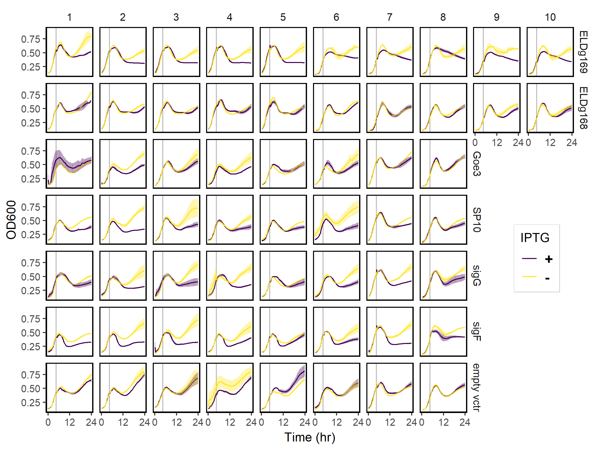

```{r setup , message=FALSE}
library(renv)
library(here)
library(tidyverse, quietly = TRUE)
```



**Growth of _Bacillus subtilis_ during sporulation assays**. Each panel shows the growth (mean ± SE, n = 3) measured as optical density (OD600) over time of cultures in which a sigma factor (row label on the right) was cloned under an IPTG-inducible promoter. The empty-vector negative control strain had the IPTG-inducible promoter without any sigma factor. Column numbers represent independent colonies from which experimental cultures were inoculated. Cultures were grown for 4.5 h (grey vertical line) in sporulation media before IPTG was added to half of them. Samples for quantifying spores and vegetative cells by flow cytometry were taken at 24 h.